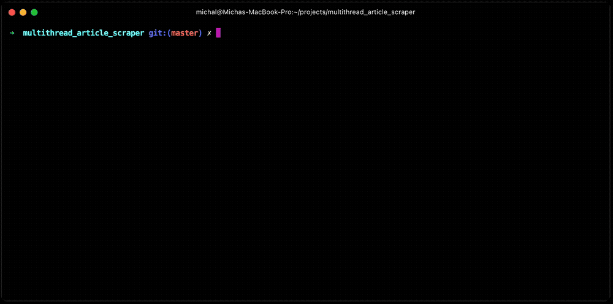

# MAS - Multi-threaded Article Scraper

## Description:
MAS reads an input file - CSV, XLS, XLSX, XLSM that contains a list of
URLs. It then scrapes the articles from the URLs and writes the article
title and text to an output file.

## Keyword Arguments:
  - input_file -- Input file containing URLs structured in the correct way. 
  Input file needs to have a column named "URL" containing the URLs.
  
  - threads -- Number of threads to use for scraping (default 4). 
  Optional, can be used with -t flag.

To run the script, use the following command:
```bash
python3 main.py <input_file> -t <threads>
```

## Usage:

